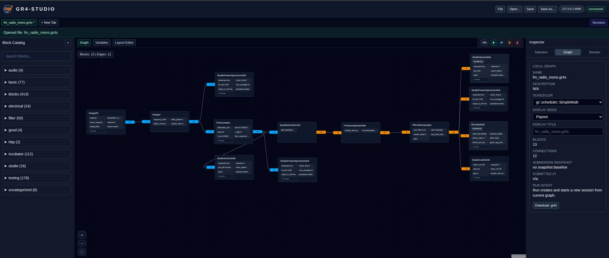
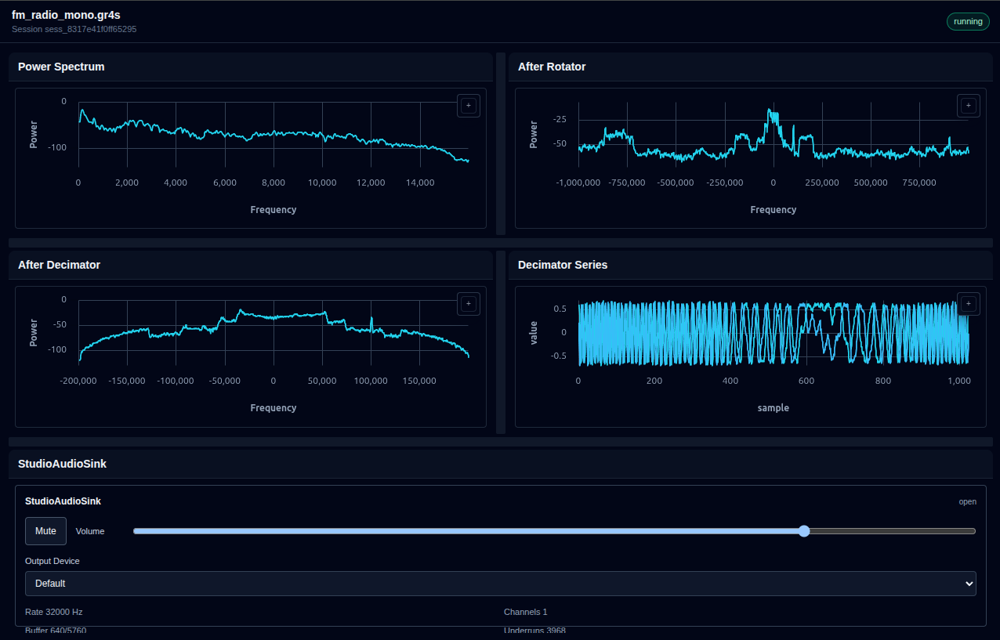

# gr4-studio

> [!IMPORTANT]
> This repository has moved.
>
> Active development has moved to: **https://github.com/gnuradio/gnuradio4-studio**
>
> This repository is retained for historical reference and will not receive future updates. Please open new issues, pull requests, and discussions in the new repository.


`gr4-studio` is a browser and desktop Studio environment for GNU Radio 4. It is focused on building flowgraphs, running them through the GR4 control plane, and turning those running graphs into live applications.

Studio is currently built around three main workflows:

- Design a GR4 flowgraph visually.
- Arrange live plots, controls, and displays into an application workspace.
- Run the graph and interact with live block parameters and graph variables.

## What You Can Do

- Browse reflected GR4 blocks and place them on a graph canvas.
- Edit block parameters, graph variables, notes, and virtual routing blocks.
- Save and open `.gr4s` Studio documents.
- Run, stop, restart, link, and delete runtime sessions.
- Build application layouts with live panels and control widgets.
- Open application views in-app, in a new tab, or in a popout window.
- Use live visualization panels for time series, XY data, power spectra, phosphor spectra, waterfall plots, images, and audio.
- Adjust running block parameters and variable-backed controls while keeping saved graph defaults intact.

## Included Studio Blocks

This repository includes first-party Studio-compatible GR4 blocks under `blocks/studio`, including:

- series and 2D series sinks
- dataset, power-spectrum, and waterfall sinks
- audio playback sink
- image sink

These are real GR4 blocks, not frontend-only stand-ins. They expose data through block-owned interfaces, and Studio binds live panels to those interfaces when a graph is running.

## Screenshots

<p align="center">
  <br>
  <em>Studio graph design surface</em>
</p>

<p align="center">
  <br>
  <em>Studio application runtime surface</em>
</p>

## Run

### Web Development

1. `npm install`
2. `npm run dev`
3. Open `http://localhost:5173`

The control-plane base URL defaults to `http://localhost:8080`. Override it with:

```env
VITE_CONTROL_PLANE_BASE_URL=http://localhost:8080
```

### Desktop Launcher

1. `npm install`
2. `GR4_PREFIX_PATH=/path/to/prefix npm run build`
3. Run `/path/to/prefix/bin/gr4-studio`

Launch modes:

- `gr4-studio` starts a local `gr4cp_server`
- `gr4-studio --remote http://host:8080` connects to a remote control plane
- `gr4-studio --remote` prompts for a remote endpoint
- `GR4_STUDIO_CONTROL_PLANE_BASE_URL=http://host:8080 gr4-studio` selects remote mode

For local desktop development, use:

```bash
npm run desktop:dev
```

For a browser-only production bundle, use:

```bash
npm run build:web
```

### Docker Development

```bash
docker compose -f docker-compose.dev.yml up --build
```

Docker development uses `VITE_CONTROL_PLANE_BASE_URL=http://host.docker.internal:8080`.

## Example Flowgraphs

Example flowgraphs live in `examples`, including an FM Radio demodulator.  More to come as more blocks are supported in `gnuradio4`.

## Current Status

Studio is an active prototype. The graph editor, runtime session workflow, application layout surface, live plots, audio playback path, and runtime controls are functional, but the control-plane contract is intentionally small and still evolving.

Some behavior is deliberately runtime-local:

- Graph edits are local until Run submits a snapshot.
- Running sessions can drift from the current editor state after more graph edits.
- Live variable overrides apply to the running session and are cleared when that session is replaced or deleted.
- Existing documents may contain older fields that are ignored by current live bindings.

## License And Copyright

This project is licensed under the GNU General Public License v3.0 or later (GPL-3.0-or-later).

Unless otherwise noted: SPDX-License-Identifier: GPL-3.0-or-later

The `blocks/` directory is licensed separately under the MIT License. See `blocks/LICENSE`.

Copyright (C) Josh Morman, Altio Labs, LLC

See `LICENSE` for the GPL-3.0-or-later license text and `blocks/LICENSE` for the MIT license text that applies to `blocks/`.
